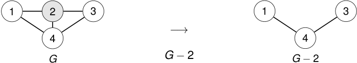

# Ejemplo: eliminar un vértice 

<!-- Start of picture text -->
1 2 3 1 3 −→ 4 4 G G − 2 G − 2 <!-- End of picture text -->

### Al eliminar un vértice también desaparecen todas sus aristas incidentes. 

2_do_ Cuatrimestre de 2026 

(DC, FCEyN, UBA) 

DC - FCEyN - UBA 

39 / 67 

Caminos, ciclos y conexidad 

Grafos bipartitos 

Definiciones básicas y notación 

Noción de isomorfismo 

Los grafos como modelos 

