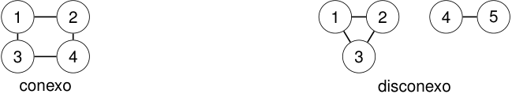

# Grafo conexo y grafo disconexo 

<!-- Start of picture text -->
1 2 1 2 4 5 3 4 3 conexo disconexo <!-- End of picture text -->

### En el segundo grafo no existe un camino de 1 a 4. 

2_do_ Cuatrimestre de 2026 44 / 67 

(DC, FCEyN, UBA) 

DC - FCEyN - UBA 

Caminos, ciclos y conexidad 

Grafos bipartitos 

Definiciones básicas y notación 

Noción de isomorfismo 

Los grafos como modelos 

