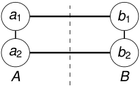

## Definición 

Una arista _e_ = _uv_ cruza la partición ( _A, B_ ) si tiene un extremo en _A_ y el otro en _B_ . Es decir, 

_u ∈ A, v ∈ B_ o _u ∈ B, v ∈ A._ 

<!-- Start of picture text -->
a 1 b 1 a 2 b 2 A B <!-- End of picture text -->

2_do_ Cuatrimestre de 2026 

(DC, FCEyN, UBA) 

DC - FCEyN - UBA 

46 / 67 

Caminos, ciclos y conexidad 

Grafos bipartitos 

Definiciones básicas y notación 

Noción de isomorfismo 

Los grafos como modelos 

