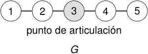
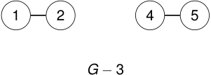

# Ejemplo: un punto de articulación 

<!-- Start of picture text -->
1 2 3 4 5 punto de articulación G <!-- End of picture text -->

<!-- Start of picture text -->
1 2 4 5 G − 3 <!-- End of picture text -->

_G_ es conexo, pero _G −_ 3 tiene dos componentes conexas. 

2_do_ Cuatrimestre de 2026 

(DC, FCEyN, UBA) 

DC - FCEyN - UBA 

51 / 67 

Caminos, ciclos y conexidad 

Grafos bipartitos 

Definiciones básicas y notación 

Noción de isomorfismo 

Los grafos como modelos 

