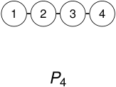
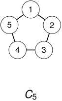
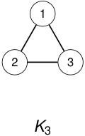

# Ejemplos 

<!-- Start of picture text -->
1 2 3 4 P 4 <!-- End of picture text -->

### No es biconexo. 

<!-- Start of picture text -->
1 5 2 4 3 C 5 <!-- End of picture text -->

Es biconexo. 

<!-- Start of picture text -->
1 2 3 K 3 <!-- End of picture text -->

Es biconexo. 

2_do_ Cuatrimestre de 2026 

(DC, FCEyN, UBA) 

DC - FCEyN - UBA 

56 / 67 

Caminos, ciclos y conexidad 

Grafos bipartitos 

Definiciones básicas y notación 

Noción de isomorfismo 

Los grafos como modelos 

