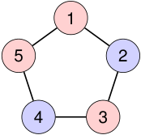

# Un ciclo impar no es bipartito 

### Intentemos colorear un ciclo alternando dos colores. 

<!-- Start of picture text -->
1 5 2 4 3 <!-- End of picture text -->

Al cerrar el ciclo, la última arista une dos vértices del mismo color: 

_{_ 5 _,_ 1 _}._ 

Por lo tanto, _C_ 5 no es bipartito. 

2_do_ Cuatrimestre de 2026 

(DC, FCEyN, UBA) 

DC - FCEyN - UBA 

66 / 67 

Caminos, ciclos y conexidad 

Grafos bipartitos 

Definiciones básicas y notación 

Noción de isomorfismo 

Los grafos como modelos 

